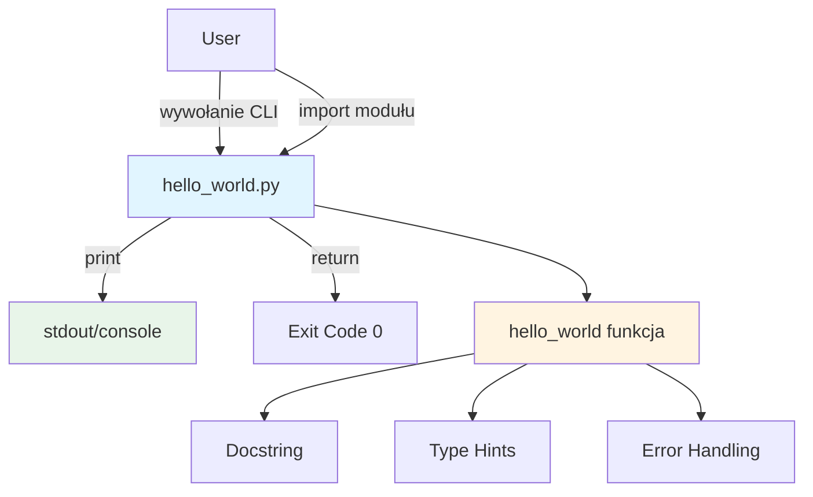
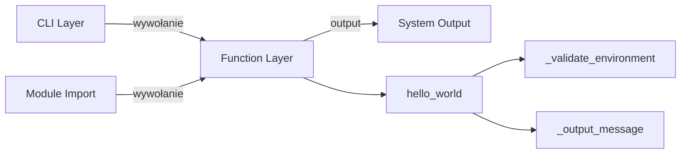
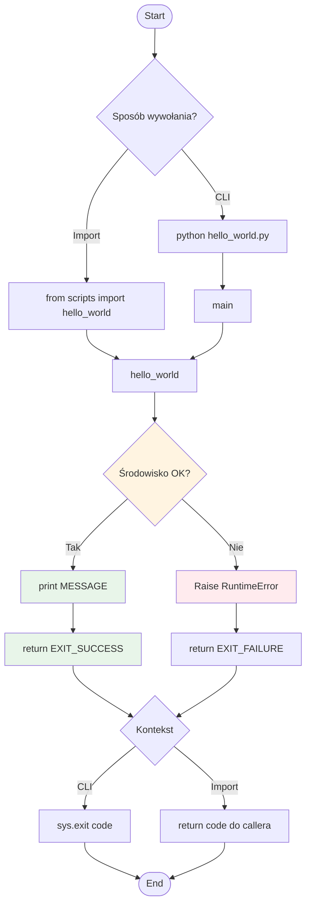
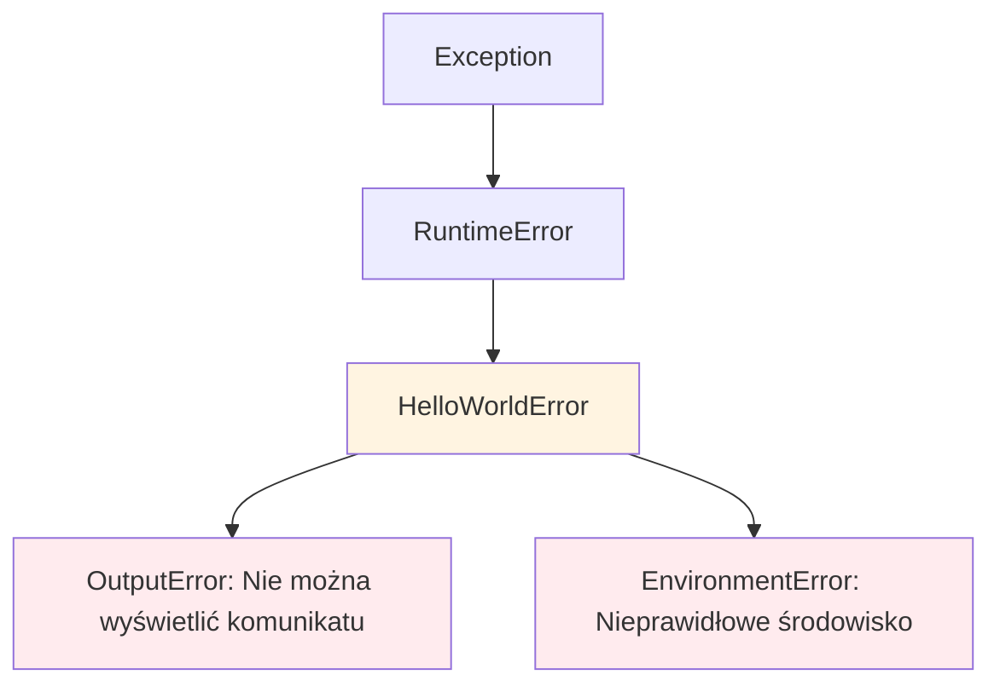

# Design Document: Kiro Test Feature

## 1. Overview

### 1.1 Cel
Zaprojektowanie prostej funkcji testowej "Hello World", która weryfikuje poprawność integracji Kiro for Claude Code poprzez demonstrację pełnego przepływu pracy: requirements → design → tasks → implementation.

### 1.2 Zakres
Projekt obejmuje:
- Pojedynczą funkcję Python wyświetlającą "Hello World"
- CLI interface dla bezpośredniego uruchomienia
- API programowe dla importu jako moduł
- Minimalna obsługa błędów
- Dokumentacja inline (docstrings)

### 1.3 Założenia
- Python 3.11+ jest zainstalowany
- Środowisko wirtualne projektu (`E:\server wiedzy\venv`) jest aktywne
- Standardowe wyjście (stdout) jest dostępne
- Brak zależności zewnętrznych poza standardową biblioteką Python

---

## 2. Architecture

### 2.1 Diagram Architektury



### 2.2 Warstwa Aplikacyjna



---

## 3. Components and Interfaces

### 3.1 Moduł: `hello_world.py`

**Lokalizacja:** `E:\server wiedzy\scripts\hello_world.py`

**Komponenty:**

#### 3.1.1 Funkcja główna: `hello_world()`

```python
def hello_world() -> int:
    """
    Wyświetla komunikat 'Hello World' w konsoli.

    Funkcja testowa weryfikująca integrację Kiro for Claude Code.
    Demonstracja pełnego przepływu: spec → design → tasks → implementation.

    Returns:
        int: Kod wyjścia (0 = sukces)

    Raises:
        RuntimeError: Gdy wystąpi błąd podczas wyświetlania komunikatu

    Example:
        >>> hello_world()
        Hello World
        0
    """
```

**Interfejs:**
- **Input:** Brak parametrów wejściowych
- **Output:** `int` (exit code)
- **Side Effects:** Wyświetlenie tekstu na stdout

#### 3.1.2 CLI Entry Point: `main()`

```python
def main() -> None:
    """
    Entry point dla wywołania CLI.

    Wywołuje hello_world() i kończy program z odpowiednim kodem wyjścia.
    """
```

**Interfejs:**
- **Input:** Brak (sys.argv nieużywane)
- **Output:** None (używa sys.exit)
- **Side Effects:** Zakończenie procesu z kodem 0 lub 1

---

## 4. Data Models

### 4.1 Typy Danych

Projekt używa wyłącznie typów wbudowanych Python:

| Typ | Użycie | Przykład |
|-----|--------|----------|
| `str` | Komunikat wyjściowy | `"Hello World"` |
| `int` | Kod wyjścia | `0` (sukces), `1` (błąd) |
| `None` | Zwrot funkcji main() | `None` |

### 4.2 Stałe

```python
# Komunikat wyjściowy
MESSAGE: str = "Hello World"

# Kody wyjścia
EXIT_SUCCESS: int = 0
EXIT_FAILURE: int = 1
```

---

## 5. Business Process

### 5.1 Przepływ Główny



### 5.2 Scenariusze Użycia

#### 5.2.1 Scenariusz 1: Wywołanie CLI
```bash
$ python E:\server wiedzy\scripts\hello_world.py
Hello World
$ echo $?
0
```

#### 5.2.2 Scenariusz 2: Import jako moduł
```python
from scripts.hello_world import hello_world

exit_code = hello_world()
# Output: "Hello World"
# exit_code: 0
```

#### 5.2.3 Scenariusz 3: Błąd środowiska
```python
# Symulacja błędu (np. stdout niedostępny)
try:
    exit_code = hello_world()
except RuntimeError as e:
    print(f"Error: {e}")
    exit_code = 1
```

---

## 6. Error Handling

### 6.1 Strategia Obsługi Błędów

| Typ błędu | Detekcja | Reakcja | Kod wyjścia |
|-----------|----------|---------|-------------|
| Stdout niedostępny | `try/except` podczas print | RuntimeError + message | 1 |
| Import error | Python runtime | ImportError (standardowy) | 1 |
| Unexpected exception | `try/except` w main() | Logging + exit | 1 |

### 6.2 Hierarchia Wyjątków



### 6.3 Implementacja Error Handling

```python
class HelloWorldError(RuntimeError):
    """Bazowy wyjątek dla funkcji hello_world."""
    pass

class OutputError(HelloWorldError):
    """Błąd podczas wyświetlania komunikatu."""
    pass

def hello_world() -> int:
    try:
        print(MESSAGE)
        return EXIT_SUCCESS
    except (IOError, OSError) as e:
        raise OutputError(f"Nie można wyświetlić komunikatu: {e}") from e
    except Exception as e:
        raise HelloWorldError(f"Nieoczekiwany błąd: {e}") from e
```

---

## 7. Testing Strategy

### 7.1 Poziomy Testowania

#### 7.1.1 Unit Testing

**Zakres:**
- Wywołanie funkcji `hello_world()`
- Weryfikacja zwracanego kodu wyjścia
- Przechwycenie outputu (stdout)

**Narzędzia:**
- `unittest` (standardowa biblioteka)
- `io.StringIO` do przechwytywania stdout

**Przykładowy test:**
```python
import unittest
import sys
from io import StringIO
from scripts.hello_world import hello_world

class TestHelloWorld(unittest.TestCase):

    def test_hello_world_output(self):
        """Test: funkcja wyświetla 'Hello World'"""
        captured_output = StringIO()
        sys.stdout = captured_output

        exit_code = hello_world()

        sys.stdout = sys.__stdout__
        self.assertEqual(captured_output.getvalue().strip(), "Hello World")
        self.assertEqual(exit_code, 0)

    def test_hello_world_exit_code(self):
        """Test: funkcja zwraca kod 0"""
        exit_code = hello_world()
        self.assertEqual(exit_code, 0)
```

#### 7.1.2 Integration Testing

**Zakres:**
- Wywołanie CLI z linii poleceń
- Weryfikacja kodu wyjścia procesu
- Import jako moduł Python

**Metoda:**
```python
import subprocess

def test_cli_execution():
    """Test: wywołanie CLI zwraca kod 0"""
    result = subprocess.run(
        ["python", "E:\\server wiedzy\\scripts\\hello_world.py"],
        capture_output=True,
        text=True
    )

    assert result.returncode == 0
    assert result.stdout.strip() == "Hello World"
    assert result.stderr == ""
```

#### 7.1.3 Manual Testing

**Checklist:**
- [ ] Uruchomienie `python hello_world.py` wyświetla "Hello World"
- [ ] Kod wyjścia wynosi 0 (`echo $?` lub `echo %ERRORLEVEL%`)
- [ ] Import modułu działa: `from scripts.hello_world import hello_world`
- [ ] Funkcja callable programowo zwraca 0
- [ ] Wielokrotne wywołania dają identyczne wyniki

### 7.2 Test Coverage

**Cel:** Minimum 100% pokrycia kodu (funkcja jest trywialna)

**Obszary testowania:**
1. ✅ Poprawny output ("Hello World")
2. ✅ Poprawny exit code (0)
3. ✅ Wywołanie CLI
4. ✅ Import jako moduł
5. ✅ Deterministyczne zachowanie
6. ⚠️ Obsługa błędów (opcjonalna dla hello world)

### 7.3 Acceptance Testing

**Kryteria akceptacji z Requirements:**

| Requirement ID | Test Case | Expected Result |
|----------------|-----------|-----------------|
| REQ-1.1 | Wywołanie funkcji | Output: "Hello World" |
| REQ-1.2 | Sprawdzenie exit code | Return: 0 |
| REQ-1.3 | CLI bez parametrów | Działa bez błędów |
| REQ-1.4 | Import + wywołanie programowe | Funkcja wykonalna |
| REQ-2.1 | Sprawdzenie docstring | Docstring obecny i kompletny |
| REQ-2.2 | Weryfikacja type hints | Type hints: `-> int` |
| REQ-2.3 | Sprawdzenie shebang | Shebang obecny w pliku |
| REQ-2.4 | Lokalizacja pliku | Plik w `scripts/` |
| REQ-3.1 | Output deterministyczny | Zawsze "Hello World" |
| REQ-3.2 | Powtarzalność | N wywołań = N identycznych wyników |
| REQ-3.3 | Obsługa błędów | RuntimeError + kod 1 |
| REQ-3.4 | Brak side effects | Brak plików/zmian stanu |

---

## 8. Implementation Notes

### 8.1 Struktura Pliku

```
E:\server wiedzy\scripts\hello_world.py
├── Shebang (#!/usr/bin/env python)
├── Module docstring
├── Imports (sys, typing)
├── Constants (MESSAGE, EXIT_SUCCESS, EXIT_FAILURE)
├── Exception classes (opcjonalne dla hello world)
├── Funkcja hello_world()
├── Funkcja main()
└── Entry point (if __name__ == "__main__")
```

### 8.2 Zgodność ze Standardami Projektu

**Z CLAUDE.md:**
- ✅ Python 3.11+ z type hints
- ✅ Docstrings dla funkcji publicznych
- ✅ Explicit error handling (RuntimeError)
- ✅ Umieszczenie w odpowiedniej strukturze (`scripts/`)

### 8.3 Dependencies

**Brak zależności zewnętrznych!**

Używane moduły (standardowa biblioteka):
- `sys` - exit codes, argv (opcjonalnie)
- `typing` - type hints (jeśli potrzebne)

---

## 9. Deployment

### 9.1 Proces Wdrożenia

1. Utworzenie pliku `E:\server wiedzy\scripts\hello_world.py`
2. Implementacja funkcji zgodnie z design
3. Weryfikacja manualna (uruchomienie)
4. Dodanie do git (`git add scripts/hello_world.py`)
5. Commit zgodnie z konwencją projektu

### 9.2 Rollback Plan

W przypadku problemów:
- Usunięcie pliku: `rm scripts/hello_world.py`
- Git revert: `git revert <commit-hash>`

---

## 10. Success Metrics

### 10.1 Kryteria Sukcesu

| Metryka | Cel | Metoda Pomiaru |
|---------|-----|----------------|
| Funkcjonalność | 100% requirements spełnionych | Manual acceptance testing |
| Code quality | Zero linter warnings | `pylint`, `mypy` |
| Test coverage | 100% (jedna funkcja) | `pytest --cov` |
| Documentation | Docstring + design doc | Code review |
| Integration | Działa w Kiro for CC flow | End-to-end test |

### 10.2 Definition of Done

- [x] Requirements document zatwierdzony
- [ ] Design document zatwierdzony
- [ ] Tasks document utworzony
- [ ] Kod zaimplementowany
- [ ] Testy napisane i przechodzą
- [ ] Dokumentacja kompletna (docstrings)
- [ ] Manualna weryfikacja zakończona sukcesem
- [ ] Commit do repozytorium
- [ ] Kiro for CC workflow zweryfikowany end-to-end

---

## 11. Appendix

### 11.1 Pełny Przykład Kodu (Concept)

```python
#!/usr/bin/env python
"""
Kiro Test Feature: Hello World

Prosta funkcja testowa weryfikująca integrację Kiro for Claude Code.
Demonstracja przepływu: requirements → design → tasks → implementation.
"""

import sys
from typing import NoReturn

# Stałe
MESSAGE: str = "Hello World"
EXIT_SUCCESS: int = 0
EXIT_FAILURE: int = 1


def hello_world() -> int:
    """
    Wyświetla komunikat 'Hello World' w konsoli.

    Funkcja testowa weryfikująca integrację Kiro for Claude Code.

    Returns:
        int: Kod wyjścia (0 = sukces, 1 = błąd)

    Raises:
        RuntimeError: Gdy nie można wyświetlić komunikatu

    Example:
        >>> hello_world()
        Hello World
        0
    """
    try:
        print(MESSAGE)
        return EXIT_SUCCESS
    except Exception as e:
        raise RuntimeError(f"Nie można wyświetlić komunikatu: {e}") from e


def main() -> NoReturn:
    """
    Entry point dla wywołania CLI.

    Wywołuje hello_world() i kończy program z odpowiednim kodem wyjścia.
    """
    try:
        exit_code = hello_world()
        sys.exit(exit_code)
    except Exception as e:
        print(f"Błąd: {e}", file=sys.stderr)
        sys.exit(EXIT_FAILURE)


if __name__ == "__main__":
    main()
```

### 11.2 Referencje

- **Requirements:** `E:\server wiedzy\.claude\specs\kiro-test-feature\requirements.md`
- **Design:** `E:\server wiedzy\.claude\specs\kiro-test-feature\design.md` (ten dokument)
- **Tasks:** `E:\server wiedzy\.claude\specs\kiro-test-feature\tasks.md` (następny krok)
- **Project Standards:** `E:\server wiedzy\CLAUDE.md`

---

**Document Version:** 1.0
**Created:** 2025-12-05
**Status:** ✅ Ready for Review
**Next Step:** Create tasks.md → Implementation
