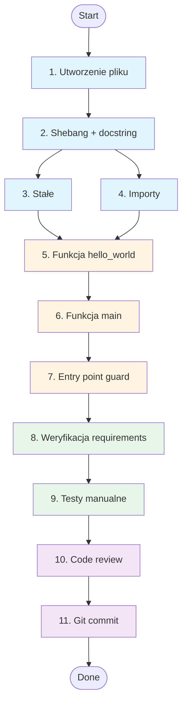

# Tasks Document: Kiro Test Feature

## Przegląd

Ten dokument zawiera listę zadań implementacyjnych dla funkcji testowej "Hello World", która weryfikuje integrację Kiro for Claude Code. Zadania są oparte na zatwierdzonych dokumentach requirements.md i design.md.

**Lokalizacja pliku docelowego:** `E:\server wiedzy\scripts\hello_world.py`

---

## Lista Zadań

### Setup i Przygotowanie

- [ ] 1. Utworzenie pliku hello_world.py w lokalizacji scripts/
  - Utworzyć plik `E:\server wiedzy\scripts\hello_world.py`
  - Upewnić się, że katalog `scripts/` istnieje
  - _Requirements: REQ-2.4_

- [ ] 2. Dodanie shebang i module docstring
  - Dodać shebang: `#!/usr/bin/env python`
  - Napisać module docstring opisujący cel funkcji testowej
  - Uwzględnić informację o Kiro for CC workflow
  - _Requirements: REQ-2.3, REQ-2.1_

### Implementacja Stałych i Typów

- [ ] 3. Zdefiniowanie stałych programu
  - Zdefiniować `MESSAGE: str = "Hello World"`
  - Zdefiniować `EXIT_SUCCESS: int = 0`
  - Zdefiniować `EXIT_FAILURE: int = 1`
  - Użyć type hints zgodnie z Python 3.11+
  - _Requirements: REQ-2.2_

- [ ] 4. Dodanie importów (opcjonalne)
  - Dodać `import sys` (dla sys.exit w main())
  - Dodać `from typing import NoReturn` (dla type hint main())
  - _Requirements: REQ-2.2_

### Implementacja Funkcji Głównej

- [ ] 5. Implementacja funkcji hello_world()
  - Zdefiniować sygnaturę: `def hello_world() -> int:`
  - Dodać kompletny docstring z sekcjami: opis, Returns, Raises, Example
  - Zaimplementować `print(MESSAGE)` z obsługą wyjątków
  - Zwrócić `EXIT_SUCCESS` po sukcesie
  - Dodać try/except dla obsługi błędów (RuntimeError)
  - _Requirements: REQ-1.1, REQ-1.2, REQ-1.4, REQ-2.1, REQ-2.2, REQ-3.3_

### Implementacja CLI Entry Point

- [ ] 6. Implementacja funkcji main()
  - Zdefiniować sygnaturę: `def main() -> NoReturn:`
  - Dodać docstring opisujący entry point CLI
  - Wywołać `hello_world()` i przechwycić exit_code
  - Użyć `sys.exit(exit_code)` do zakończenia procesu
  - Dodać try/except dla obsługi błędów z komunikatem na stderr
  - _Requirements: REQ-1.3, REQ-3.3_

- [ ] 7. Dodanie warunku if __name__ == "__main__"
  - Dodać standardowy guard: `if __name__ == "__main__":`
  - Wywołać `main()` wewnątrz guarda
  - _Requirements: REQ-1.3_

### Weryfikacja i Jakość Kodu

- [ ] 8. Weryfikacja zgodności z requirements
  - Sprawdzić czy wszystkie Acceptance Criteria są spełnione
  - Zweryfikować obecność docstrings
  - Zweryfikować type hints dla wszystkich funkcji
  - Sprawdzić czy kod nie wymaga parametrów wejściowych
  - _Requirements: REQ-1.1, REQ-1.2, REQ-1.3, REQ-1.4, REQ-2.1, REQ-2.2_

- [ ] 9. Testy manualne
  - Uruchomić `python E:\server wiedzy\scripts\hello_world.py`
  - Zweryfikować output: "Hello World"
  - Sprawdzić exit code: `echo %ERRORLEVEL%` (Windows) = 0
  - Przetestować import: `from scripts.hello_world import hello_world`
  - Przetestować wywołanie programowe i sprawdzić return value
  - Wykonać wielokrotne wywołania i zweryfikować deterministyczne zachowanie
  - _Requirements: REQ-3.1, REQ-3.2, REQ-3.4_

### Finalizacja

- [ ] 10. Code review i standards compliance
  - Sprawdzić zgodność z CLAUDE.md (Python 3.11+, docstrings, error handling)
  - Opcjonalnie uruchomić linter (pylint/mypy) jeśli dostępny
  - Zweryfikować brak side effects (plików, zmian globalnego stanu)
  - _Requirements: REQ-2.1, REQ-2.2, REQ-3.4_

- [ ] 11. Dokumentacja i commit (opcjonalne)
  - Dodać plik do git: `git add scripts/hello_world.py`
  - Utworzyć commit z opisem zgodnym z konwencją projektu
  - Zaznaczyć Definition of Done jako ukończone
  - _Requirements: REQ-2.4_

---

## Tasks Dependency Diagram

---

## Priorytetyzacja

| Priorytet | Zadania | Uzasadnienie |
|-----------|---------|--------------|
| **P0 - Krytyczne** | 1, 2, 5, 6, 7 | Minimalna funkcjonująca implementacja |
| **P1 - Wysokie** | 3, 8, 9 | Compliance z requirements i weryfikacja |
| **P2 - Średnie** | 4, 10 | Jakość kodu i standards |
| **P3 - Niskie** | 11 | Dokumentacja i version control (opcjonalne) |

---

## Szacowany Czas Realizacji

| Zadanie | Czas (min) | Uwagi |
|---------|------------|-------|
| 1-4 | 5 | Setup i boilerplate |
| 5 | 10 | Główna funkcja + error handling |
| 6-7 | 5 | CLI entry point |
| 8-9 | 10 | Weryfikacja i testy |
| 10-11 | 5 | Finalizacja |
| **TOTAL** | **~35 min** | Prosty feature testowy |

---

## Definition of Done Checklist

- [ ] Wszystkie zadania 1-9 ukończone (P0-P1)
- [ ] Kod spełnia wszystkie requirements (REQ-1, REQ-2, REQ-3)
- [ ] Testy manualne przechodzą pozytywnie
- [ ] Output = "Hello World", Exit code = 0
- [ ] Funkcja callable zarówno przez CLI jak i import
- [ ] Docstrings i type hints obecne
- [ ] Brak side effects
- [ ] Zachowanie deterministyczne
- [ ] Zgodność z CLAUDE.md standards
- [ ] Plik w odpowiedniej lokalizacji (`scripts/`)

---

## Referencje

- **Requirements:** `E:\server wiedzy\.claude\specs\kiro-test-feature\requirements.md`
- **Design:** `E:\server wiedzy\.claude\specs\kiro-test-feature\design.md`
- **Project Standards:** `E:\server wiedzy\CLAUDE.md`
- **Target File:** `E:\server wiedzy\scripts\hello_world.py`

---

**Document Version:** 1.0
**Created:** 2025-12-05
**Status:** ✅ Ready for Implementation
**Next Step:** Implementacja hello_world.py
