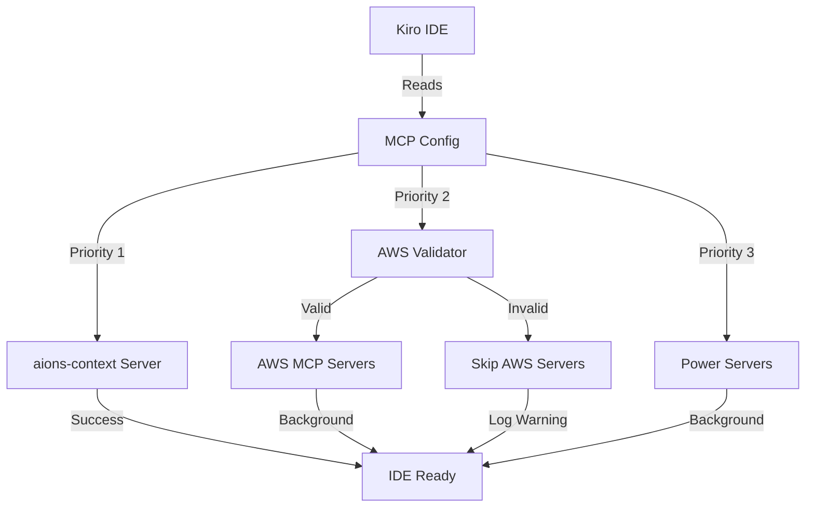

# Design Document - MCP Server Connection Fix

## Overview

This design addresses the MCP server connection timeout issues by implementing a multi-layered approach: immediate configuration fixes, AWS credential optimization, server prioritization, and diagnostic tooling. The solution focuses on reducing concurrent connection load, validating prerequisites before connection attempts, and providing clear feedback during the connection process.

The design prioritizes the working `aions-context` server while systematically addressing issues with AWS-based and Power servers that are experiencing 5-minute timeouts.

## Architecture

### Current State

```
Kiro IDE Startup
    ↓
Load MCP Config (.kiro/settings/mcp.json + .mcp.json)
    ↓
Attempt to connect ALL 12+ servers simultaneously
    ↓
Servers compete for resources:
    - aions-context: ✓ Connects successfully
    - fetch, aws-core, power-*: ✗ Timeout after 5 minutes
    ↓
User experiences delays and missing functionality
```

### Proposed Architecture

```
Kiro IDE Startup
    ↓
Load MCP Config with Priority Levels
    ↓
Phase 1: Connect Critical Servers (aions-context)
    ↓ (wait for success)
Phase 2: Validate AWS Prerequisites
    ↓ (check credentials, WSL, network)
Phase 3: Connect AWS Servers (if validation passed)
    ↓ (staggered with delays)
Phase 4: Connect Optional Power Servers
    ↓ (background, non-blocking)
User has functional IDE with core tools available
```

### Component Interaction



## Components and Interfaces

### 1. MCP Configuration Manager

**Purpose**: Centralize and optimize MCP server configuration

**Interface**:
```python
class MCPConfigManager:
    def load_config(self) -> Dict[str, ServerConfig]
    def get_priority_groups(self) -> List[List[str]]
    def disable_server(self, server_name: str) -> None
    def enable_server(self, server_name: str) -> None
    def validate_server_config(self, server_name: str) -> ValidationResult
```

**Responsibilities**:
- Merge `.mcp.json` and `.kiro/settings/mcp.json`
- Categorize servers by priority (critical, aws, optional)
- Validate command paths and arguments exist
- Provide server enable/disable functionality

### 2. AWS Prerequisite Validator

**Purpose**: Validate AWS environment before attempting server connections

**Interface**:
```python
class AWSValidator:
    def validate_credentials(self, profile: str) -> bool
    def validate_wsl_distribution(self, distro: str) -> bool
    def validate_cluster_endpoint(self, endpoint: str) -> bool
    def check_uvx_package_cached(self, package: str) -> bool
    def get_validation_report(self) -> ValidationReport
```

**Responsibilities**:
- Check AWS credentials file exists and profile is valid
- Verify WSL distribution is installed and running
- Test network connectivity to AWS endpoints
- Check if uvx packages are already downloaded
- Provide detailed validation report with actionable errors

### 3. Staggered Connection Manager

**Purpose**: Control server connection timing to prevent resource exhaustion

**Interface**:
```python
class ConnectionManager:
    def connect_priority_group(self, servers: List[str], delay_ms: int) -> None
    def connect_with_timeout(self, server: str, timeout_sec: int) -> ConnectionResult
    def get_connection_status(self) -> Dict[str, ConnectionStatus]
    def retry_failed_connection(self, server: str) -> ConnectionResult
```

**Responsibilities**:
- Connect servers in priority order
- Introduce configurable delays between connections
- Monitor connection progress and timeouts
- Support retry logic for failed connections
- Provide real-time status updates

### 4. Server Health Monitor

**Purpose**: Provide diagnostic and monitoring capabilities

**Interface**:
```python
class HealthMonitor:
    def check_server_health(self, server: str) -> HealthStatus
    def check_all_servers(self) -> Dict[str, HealthStatus]
    def get_server_metrics(self, server: str) -> ServerMetrics
    def export_diagnostic_report(self) -> str
```

**Responsibilities**:
- Test server connectivity and responsiveness
- Measure connection times and latency
- Identify common failure patterns
- Generate diagnostic reports for troubleshooting

### 5. Configuration Optimizer

**Purpose**: Analyze and recommend configuration improvements

**Interface**:
```python
class ConfigOptimizer:
    def analyze_server_usage(self) -> UsageReport
    def recommend_disabled_servers(self) -> List[str]
    def identify_redundant_servers(self) -> List[Tuple[str, str]]
    def generate_optimized_config(self) -> Dict[str, Any]
```

**Responsibilities**:
- Track server usage patterns
- Identify unused or redundant servers
- Recommend configuration changes
- Generate optimized configuration files

## Data Models

### ServerConfig

```python
@dataclass
class ServerConfig:
    name: str
    command: str
    args: List[str]
    env: Dict[str, str]
    disabled: bool = False
    priority: int = 3  # 1=critical, 2=aws, 3=optional
    auto_approve: List[str] = field(default_factory=list)
    timeout_seconds: int = 300
    retry_count: int = 2
    requires_aws: bool = False
    requires_wsl: bool = False
```

### ConnectionResult

```python
@dataclass
class ConnectionResult:
    server_name: str
    success: bool
    connection_time_ms: int
    error_message: Optional[str] = None
    stderr_output: Optional[str] = None
    retry_attempted: bool = False
```

### ValidationReport

```python
@dataclass
class ValidationReport:
    aws_credentials_valid: bool
    wsl_available: bool
    cluster_reachable: bool
    uvx_packages_cached: Dict[str, bool]
    errors: List[str]
    warnings: List[str]
    recommendations: List[str]
```

### HealthStatus

```python
@dataclass
class HealthStatus:
    server_name: str
    is_healthy: bool
    response_time_ms: int
    last_check: datetime
    error_details: Optional[str] = None
    tools_available: int = 0
```

## Correctness Properties

*A property is a characteristic or behavior that should hold true across all valid executions of a system-essentially, a formal statement about what the system should do. Properties serve as the bridge between human-readable specifications and machine-verifiable correctness guarantees.*

### Property 1: Critical Server Priority

*For any* MCP configuration with multiple servers, when the system starts, the aions-context server SHALL attempt connection before any other servers
**Validates: Requirements 3.1, 3.2**

### Property 2: AWS Validation Before Connection

*For any* AWS-based MCP server, when connection is attempted, AWS credential validation SHALL complete successfully before the connection attempt begins
**Validates: Requirements 4.1, 4.4**

### Property 3: Staggered Connection Timing

*For any* set of MCP servers in the same priority group, when connecting sequentially, there SHALL be a minimum delay between each connection attempt
**Validates: Requirements 3.3**

### Property 4: Timeout Non-Blocking

*For any* MCP server that times out, when the timeout occurs, other servers SHALL continue their connection attempts without blocking
**Validates: Requirements 3.4**

### Property 5: Configuration Validation

*For any* MCP server configuration, when the configuration is loaded, all command paths and required environment variables SHALL be validated before connection attempts
**Validates: Requirements 2.2, 2.3**

### Property 6: Disabled Server Exclusion

*For any* MCP server marked as disabled in configuration, when the system loads servers, that server SHALL NOT attempt connection
**Validates: Requirements 2.5, 5.3**

### Property 7: Health Check Completeness

*For any* health check execution, when checking all servers, the health check SHALL test every enabled server exactly once
**Validates: Requirements 7.2**

### Property 8: Error Message Clarity

*For any* server connection failure, when the failure is logged, the error message SHALL include the server name, failure type, and actionable remediation steps
**Validates: Requirements 6.1, 6.2, 6.3**

### Property 9: WSL Prerequisite Validation

*For any* MCP server requiring WSL, when WSL distribution validation fails, the server connection attempt SHALL be skipped with a clear error message
**Validates: Requirements 4.2**

### Property 10: Configuration Merge Consistency

*For any* MCP server defined in both .mcp.json and .kiro/settings/mcp.json, when configurations are merged, the .kiro/settings/mcp.json values SHALL take precedence
**Validates: Requirements 2.1**

## Error Handling

### Connection Timeout Errors

**Strategy**: Implement progressive timeout with early failure detection

- **Detection**: Monitor server stderr output for error patterns
- **Response**: If error detected within first 30 seconds, fail fast instead of waiting full 5 minutes
- **Recovery**: Log detailed error, mark server as failed, continue with other servers
- **User Feedback**: Display notification with server name and error summary

### AWS Credential Errors

**Strategy**: Pre-validate credentials before connection attempts

- **Detection**: Run `aws sts get-caller-identity` with specified profile
- **Response**: If validation fails, skip all AWS servers and log warning
- **Recovery**: Provide instructions for credential configuration
- **User Feedback**: Show notification with link to AWS credential setup guide

### WSL Distribution Errors

**Strategy**: Verify WSL availability before attempting WSL-based servers

- **Detection**: Run `wsl -l -v` to list distributions
- **Response**: If specified distribution not found, skip WSL-dependent servers
- **Recovery**: Provide instructions for WSL installation
- **User Feedback**: Display warning with WSL setup instructions

### uvx Package Download Errors

**Strategy**: Pre-download packages or provide clear progress indication

- **Detection**: Monitor uvx stderr for download progress
- **Response**: If download fails, retry once with verbose logging
- **Recovery**: Cache successful downloads for future use
- **User Feedback**: Show progress bar for package downloads

### Command Path Errors

**Strategy**: Validate all command paths during configuration load

- **Detection**: Check if command executable exists at specified path
- **Response**: If path invalid, mark server as misconfigured
- **Recovery**: Suggest correct path based on common installation locations
- **User Feedback**: Display configuration error with suggested fix

## Testing Strategy

### Unit Testing

**Framework**: pytest

**Coverage Areas**:
- MCPConfigManager: Configuration loading, merging, validation
- AWSValidator: Credential checking, WSL validation, endpoint reachability
- ConnectionManager: Priority ordering, delay timing, timeout handling
- HealthMonitor: Health check logic, metric collection
- ConfigOptimizer: Usage analysis, recommendation generation

**Key Test Cases**:
- Configuration merge with conflicting values
- AWS credential validation with missing profile
- Connection timeout handling
- Priority group ordering
- Server enable/disable functionality

### Integration Testing

**Framework**: pytest with subprocess mocking

**Coverage Areas**:
- End-to-end server connection flow
- AWS validation integration with connection manager
- Health check against mock MCP servers
- Configuration optimization workflow

**Key Test Cases**:
- Full startup sequence with mixed server states
- AWS validation failure preventing connections
- Staggered connection with realistic delays
- Health check identifying failed servers

### Property-Based Testing

**Framework**: Hypothesis (Python property-based testing library)

**Configuration**: Minimum 100 iterations per property test

**Test Implementation**:
- Each property test will be tagged with: `# Feature: mcp-connection-fix, Property X: [property text]`
- Tests will generate random server configurations and validate properties hold

### Manual Testing

**Test Scenarios**:
1. Fresh Kiro startup with all servers enabled
2. Startup with AWS credentials missing
3. Startup with WSL not installed
4. Startup with some servers disabled
5. Health check execution with mixed server states
6. Configuration optimization recommendations

### Performance Testing

**Metrics to Measure**:
- Time to first server connection (aions-context)
- Total time to all servers connected
- Memory usage during concurrent connections
- CPU usage during connection phase

**Acceptance Criteria**:
- aions-context connects within 10 seconds
- Total connection time reduced by 50% from current state
- No memory leaks during connection/disconnection cycles

## Implementation Notes

### Immediate Quick Fixes

These can be applied immediately without code changes:

1. **Disable Unused Servers**: Edit `.kiro/settings/mcp.json` to set `"disabled": true` for:
   - `aws-core` (already disabled)
   - All `power-saas-builder-*` servers if not actively using SaaS features
   - `power-aurora-dsql-aws-core` if not using Aurora DSQL

2. **Validate AWS Credentials**: Run `aws sts get-caller-identity --profile 125140434314` to verify credentials work

3. **Pre-download uvx Packages**: Run `uvx --from awslabs.aurora-dsql-mcp-server awslabs.aurora-dsql-mcp-server --help` to cache the package

4. **Check WSL**: Run `wsl -d Ubuntu -- echo "WSL OK"` to verify WSL distribution is accessible

### Configuration Priority Levels

Recommended priority assignments:

- **Priority 1 (Critical)**: `aions-context`
- **Priority 2 (AWS)**: `aurora-dsql`, `power-aurora-dsql-aurora-dsql`
- **Priority 3 (Optional)**: All Power servers, `fetch`, `aws-core`

### Timeout Adjustments

Recommended timeout values:

- Critical servers: 60 seconds (should connect quickly)
- AWS servers: 120 seconds (allow for credential validation)
- Optional servers: 180 seconds (can take longer, non-blocking)

### Stagger Delays

Recommended delays between connection attempts:

- Between priority groups: 5 seconds
- Within priority group: 2 seconds
- After failure: 10 seconds before retry

### Logging Enhancements

Add structured logging with levels:

- **INFO**: Server connection started/completed
- **WARNING**: Server taking longer than expected
- **ERROR**: Server connection failed with details
- **DEBUG**: Detailed stderr output from servers

### Future Enhancements

- **Lazy Loading**: Connect servers on-demand when tools are first requested
- **Connection Pooling**: Reuse connections for servers that support it
- **Health-Based Routing**: Automatically disable unhealthy servers
- **Configuration UI**: Visual interface for managing server settings
- **Telemetry**: Collect anonymous usage data to identify common issues
