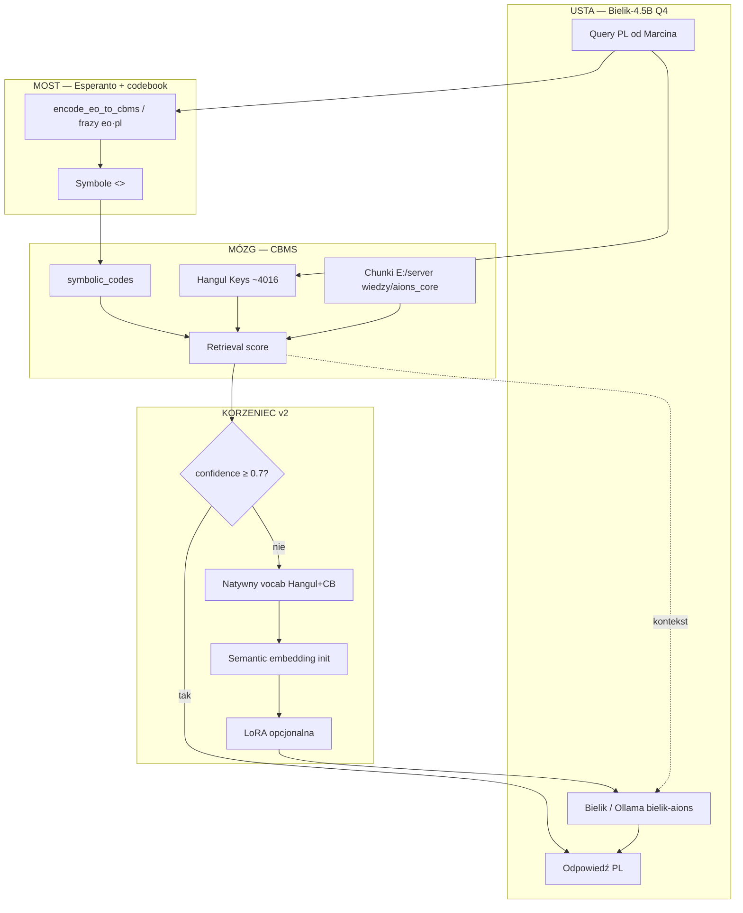
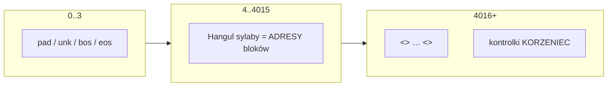

# KORZENIEC — Architektura

## Widok systemu



## Warstwy tokenów



## Init embeddingów (anti-randn)

```mermaid
flowchart TB
  SYL[Sylaba Hangul] --> JAMO[Decompose 초/중/종]
  JAMO --> MJ[Mean-pool feature vec jamo]
  MJ --> MIX1[Mix + L2]

  CB[Symbol codebook] --> PH[sem + eo[] + pl[]]
  PH --> MP[Mean-pool phrase features]
  MP --> MIX2[Mix + L2]

  MIX1 --> TABLE[artifacts/embeddings]
  MIX2 --> TABLE

  RANDN["torch.randn — ZAKAZANE"] -.->|Phi-KR failure mode| X[✗]
```

## Inference policy

| Warunek | Akcja |
|---------|--------|
| `max_retrieval_score >= 0.7` | Compose z chunków CBMS — **bez LLM** |
| `score < 0.7`, tier=small | Bielik + top-k kontekst |
| `score < 0.7`, tier=large | phi4 (istniejący large) — poza VRAM Q4 path |
| Sekwencja `<addr>…</addr><cbms>…` | Opcjonalna LoRA (rank 8) na q/v/o |

## Co jest „myśleniem w CBMS”

1. Query → adresy Hangul + kody symboliczne (nie surowy bag-of-words).
2. Retrieval po dwóch kanałach: Korean keys + codebook `symbolic_codes`.
3. Gate: mózg decyduje, czy usta w ogóle się otwierają.
4. Gdy usta mówią — widzą tokeny adresów zainicjowane **semantycznie**, nie szumem.

## Artefakty (write policy)

```
aions_cbms_llm_v2/
  artifacts/
    vocab/korzeniec_vocab.json
    embeddings/init_report.json
    embeddings/korzeniec_embeddings.json
```

Źródła (`LOCAL LLM MODELS`, chunki CBMS) = **read-only**.
