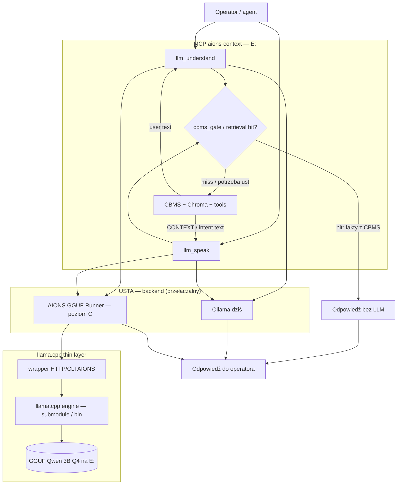
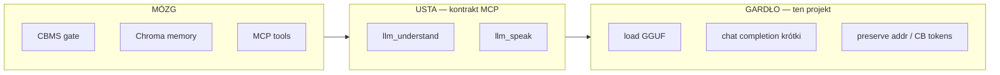

# DESIGN — AIONS GGUF Runner (poziom C)

**Wersja:** 0.2 (AIONS-first) · **Data:** 2026-07-11 · **Język:** PL (Marcin)

---

## 1. Cel / non-goals

### Cel

Zbudować **cienki runner GGUF** (minimalny fork lub submodule llama.cpp + wrapper HTTP/CLI), który:

1. Jest **gardłem/ustami AIONS** — nie „kolejnym serwerem LLM”.
2. Podłącza się pod istniejące MCP: `llm_speak`, `llm_understand` (dziś Ollama w `llm_mouth.py`).
3. Szanuje kontrakt mózgu: CBMS gate / Chroma / tools decydują; model tylko **przeformułowuje** lub zwraca **krótki intent JSON**.
4. Natywnie respektuje w prompt path:
   - Hangul w `<addr>…</addr>` = **adresy bloków CBMS**
   - `<<CB:*>>` = symbole codebook
   - mały `n_predict` (domyślnie ~200 jak `AIONS_MOUTH_NUM_PREDICT`)
5. Działa na Quadro M2000M **4 GB** / 64 GB RAM / Windows, z GGUF preferencyjnie z **E:**.

### Non-goals

| To NIE jest | Dlaczego |
|-------------|----------|
| Drugi mózg / zamiennik CBMS | Mózg = CBMS + Chroma + MCP na `E:\server wiedzy` |
| Trening HF / LoRA / fine-tune | Osobne eksperymenty (np. KORZENIEC); tu tylko inference |
| Klon Ollamy (UI, model library, `ollama pull`) | Zasada: nie budować drugiej Ollamy od zera |
| Generyczny ChatGPT-clone API jako produkt | Endpointy = **speak / understand** (+ cienki health/load), nie „open chat playground” |
| Model Runtime (adapter warstwa) | Osobny task — ten dokument = tylko runner (ścieżka C) |
| Image / multimodal | Faza 3 OUT OF SCOPE (wzmianka tylko) |
| Destrukcja `D:\LOCAL LLM MODELS` | Read-only lub kopia na E: |

---

## 2. Architektura (AIONS-first)



### Zasada przepływu

1. **Gate hit** → runner **nie startuje** (sukces = omijanie ust).
2. **Miss / speak** → CONTEXT z mózgu (może zawierać `<addr>`, `<<CB:A1>>`, fragmenty chunków) → runner generuje **krótki** reply.
3. **Understand** → user text → runner zwraca **tylko** JSON intent (`lang`, `need`, `remember`, `summary`) — bez narzędzi, bez faktów.

### Warstwy odpowiedzialności



---

## 3. Zakres forka vs upstream

**Preferencja:** minimalny fork / **git submodule** llama.cpp + **cienki wrapper AIONS** (Python lub C++ thin server). Nie forkować całego ekosystemu Ollamy.

| Element | Strategia | Uwagi |
|---------|-----------|--------|
| `llama.cpp` (upstream) | **Submodule** lub pinned release binary | Update okresowy; nie trzymać pełnej kopii historii w repo AIONS |
| Build Windows (CUDA / Vulkan / CPU) | Skrypt w `experiments/aions_gguf_runner/build/` (później) | Quadro M2000M = stary CUDA; Vulkan może być plan B |
| HTTP/CLI wrapper | **Własny, cienki** kod AIONS | Endpointy speak/understand, nie pełne OpenAI-compat jako cel |
| Prompt templates | Własne (ChatML Qwen + system usta) | Zgodne z `llm_mouth.py` SYSTEM strings |
| Presets CBMS | Własne: stop tokens, `n_predict`, pass-through `<addr>` / `<<CB:*>>` | Zero „koreańskiego stylisty” |
| Model registry / pull | **Nie** | Ścieżki plików GGUF lokalnie |
| UI web | **Nie** | |

**Kiedy fork (nie tylko wrapper):** tylko jeśli trzeba patcha silnika (np. specjalne tokeny / stop / grammar JSON). Domyślnie: **bez forka silnika** — grammar/JSON mode z upstream jeśli wystarczy.

---

## 4. API runnera (AIONS-first, nie ChatGPT clone)

Cel: 1:1 pod przyszły backend `llm_mouth` (env zamiast `OLLAMA_HOST`).

### 4.1 Preferowane endpointy HTTP

Bazowy host (propozycja): `http://127.0.0.1:11435` (obok Ollamy `:11434`, bez kolizji).

| Method | Path | Rola |
|--------|------|------|
| `GET` | `/health` | status, loaded model, backend (cpu/cuda/vulkan), vram hint |
| `POST` | `/v1/understand` | Intent JSON — odpowiednik `llm_understand` |
| `POST` | `/v1/speak` | Krótki reply z CONTEXT — odpowiednik `llm_speak` |
| `POST` | `/v1/load` | Załaduj slot modelu (Faza 2) |
| `POST` | `/v1/unload` | Zwolnij VRAM/RAM |
| `GET` | `/v1/models` | Lista zarejestrowanych tagów lokalnych |

**Świadomie pominięte jako produkt:** pełne `/v1/chat/completions` OpenAI-style jako główny UX. Opcjonalnie wewnętrznie cienki `completion` dla debug — nie w kryteriach sukcesu.

#### `POST /v1/understand`

```json
{
  "text": "user utterance",
  "model": "aions-mouth",
  "options": { "temperature": 0.1, "n_predict": 120 }
}
```

Odpowiedź (kontrakt jak dziś `understand()`):

```json
{
  "ok": true,
  "intent": {
    "lang": "pl",
    "need": "cbms",
    "remember": false,
    "summary": "…"
  },
  "model": "aions-mouth",
  "eval_count": 42,
  "eval_duration_ms": 800
}
```

System prompt = stały AIONS Mouth (jak `UNDERSTAND_SYSTEM` w `llm_mouth.py`). Model **nie** woła tools.

#### `POST /v1/speak`

```json
{
  "context": "fakty z AIONS; może zawierać <addr>각</addr> i <<CB:A1>>",
  "user_lang": "pl",
  "model": "aions-mouth",
  "options": { "temperature": 0.3, "n_predict": 200 }
}
```

Odpowiedź:

```json
{
  "ok": true,
  "reply": "krótka odpowiedź PL…",
  "user_lang": "pl",
  "model": "aions-mouth",
  "eval_count": 80,
  "eval_duration_ms": 1500
}
```

**Reguły speak (egzekwowane w wrapperze + system prompt):**

- Używaj **tylko** CONTEXT — zero fantazji.
- Nie rozwijaj Hangul / `<<CB:*>>` w „ładny koreański”; jeśli adres jest w kontekście jako fakt/adres — zachowaj lub pomiń zgodnie z instrukcją mózgu, **nie** parafrazuj jako NLG KR.
- Domyślnie 2–6 zdań; `n_predict` mały.

### 4.2 CLI (parity / bench)

```text
aions-gguf health
aions-gguf understand --text "..."
aions-gguf speak --context-file ctx.txt --lang pl
aions-gguf bench --gguf PATH --prompt-file ...   # tok/s vs Ollama
```

### 4.3 Integracja z istniejącym kodem

| Element dziś | Po podłączeniu runnera |
|--------------|------------------------|
| `llm_mouth.py` → `OLLAMA_HOST` `/api/chat` | Adapter: jeśli `AIONS_MOUTH_BACKEND=gguf` → `AIONS_GGUF_HOST` `/v1/speak\|understand` |
| `AIONS_MOUTH_MODEL=aions-mouth` | Ten sam tag mapowany na ścieżkę GGUF w config runnera |
| `AIONS_MOUTH_NUM_PREDICT` | Mapowane na `n_predict` |
| `cbms_gate` / retrieval hit | **Bez zmian** — hit omija usta (Ollama i runner) |
| Model Runtime (osobny) | Może wybrać backend ollama\|gguf; ten projekt dostarcza tylko gguf |

---

## 5. Modele, ścieżki, VRAM

### Ścieżki (preferuj E:)

| Rola | Ścieżka | Tryb |
|------|---------|------|
| GGUF usta (kanoniczny) | `E:\server wiedzy\models\qwen2.5-3b-instruct\qwen2.5-3b-instruct-q4_K_M.gguf` | read |
| Modelfile / docs Qwen | `E:\server wiedzy\models\qwen2.5-3b-instruct\` | read |
| Ten projekt | `E:\server wiedzy\experiments\aions_gguf_runner\` | design → później build |
| Bielik GGUF (opcjonalnie slot 2) | `D:\LOCAL LLM MODELS\Bielik-4.5B-Q4_K_M\…` | **read-only**; kopia na E: jeśli runner ma trzymać lokalnie |
| Ollama blobs (dziś) | `D:\fitness-app\ollama-models` | nie ruszać destrukcyjnie |

### Tagi

| Tag | Model | Budżet 4 GB |
|-----|-------|-------------|
| `aions-mouth` | Qwen2.5-3B Instruct Q4_K_M (~1.9 GB) | **Primary** — mieści się z zapasem ctx |
| `bielik-aions` | Bielik-4.5B Q4_K_M | Secondary — ciasno na 4 GB VRAM; często CPU/offload |

### VRAM budget (Quadro M2000M 4 GB)

- Primary path: **Qwen 3B Q4**, `n_ctx` 2k–4k, `n_predict` ≤ 200.
- Unload między slotami (Faza 2) — nie trzymaj Qwen+Bielik naraz w VRAM.
- Jeśli CUDA na Maxwell/Pascal problematyczne → Vulkan lub CPU (64 GB RAM = OK dla 3B).

### Hangul / codebook w ścieżce modelu

Runner **nie** dodaje koreańskiego NLG. Opcjonalnie (Faza 1+):

- lista „protected spans”: regex `<addr>[\s\S]*?</addr>`, `<<CB:[A-Za-z0-9_-]+>>`
- w post-process: nie stripuj; w system prompt: „treat as opaque addresses”
- grammar JSON dla `/understand` (upstream llama.cpp grammar) — stabilniejszy intent

---

## 6. Fazy wdrożenia (estymaty)

| Faza | Zakres | Estymata | Done when |
|------|--------|----------|-----------|
| **0 — Proof** | Submodule/bin llama.cpp; load GGUF z E:; CLI one-shot speak; bench tok/s vs Ollama ten sam GGUF | 1–3 dni | Liczby tok/s + sample speak zapisane |
| **1 — Parity ust** | HTTP `/v1/speak` + `/v1/understand`; env switch w `llm_mouth`; short `n_predict`; protect addr/CB | 3–7 dni | MCP smoke: understand+speak przez runner; gate hit nadal bez LLM |
| **2 — Multi-slot** | `/v1/load\|unload`; tagi `aions-mouth` / `bielik-aions`; exclusive VRAM | 3–5 dni | Switch modelu bez restartu hosta MCP |
| **3 — Image** | Multimodal | — | **OUT OF SCOPE** (tylko wzmianka) |

Równolegle **nie** blokować Ollamy — dual backend do czasu stabilnego parity.

---

## 7. Ryzyka

| Ryzyko | Impact | Mitygacja |
|--------|--------|-----------|
| Windows build llama.cpp (MSVC/CUDA) | Blokada Fazy 0 | Prefab release + Vulkan/CPU; dokumentuj toolchain |
| CUDA na M2000M (stary GPU) | Brak GPU accel | Vulkan lub CPU; sukces = tok/s ≥ Ollama na **tym samym** urządzeniu |
| Drift upstream llama.cpp | Utrzymanie | Submodule pin + rzadkie bump; zero głębokiego forka |
| „Generyczny serwer” creep | Rozmycie AIONS-first | Kryteria sukcesu = speak/understand + gate bypass, nie feature parity Ollama |
| Stripowanie / mutacja Hangul/`<<CB:*>>` przez model | Utrata adresów | Testy golden + protected spans w wrapperze; **empiria 2026-07-11:** Ollama `aions-mouth` zamieniła `<addr>각</addr>` → `<addr>język</addr>` (S5 symulacji) — CB `<<CB:*>>` przeżyły |
| Bielik 4.5B na 4 GB | OOM / swap | Slot secondary, CPU offload, nie primary mouth |
| Dublowanie Model Runtime | Chaos API | Ten projekt = tylko inference; adapter osobno |

---

## 8. Kryteria sukcesu

### Must (Faza 1)

1. **Ten sam GGUF** Qwen 3B Q4: runner `speak` / `understand` użyteczne jak Ollama (smoke MCP).
2. **Tok/s** ≥ Ollama na tym samym GGUF i tym samym backendzie (CPU vs CPU lub GPU vs GPU) — zapis w `artifacts/bench_*.json`.
3. **Gate hit omija runner:** przy pewnym CBMS hit ścieżka odpowiedzi **nie** woła HTTP runnera (log/metryka `mouth_calls=0`).
4. **Adresy:** golden test — CONTEXT z `<addr>…</addr>` i `<<CB:A1>>` nie jest „przetłumaczony na koreański NLG” ani usunięty przez wrapper.
5. **Krótkość:** domyślny `n_predict` ≤ 200; speak nie produkuje eseju przy typowym CONTEXT.
6. **Read-only wag na D:** brak zapisów do `D:\LOCAL LLM MODELS`.

### Nice (Faza 2)

- Hot-swap `aions-mouth` ↔ `bielik-aions` z unload.
- JSON grammar na `/understand` → 0% fail parse w smoke set.

---

## 9. Mapowanie env (propozycja)

```text
AIONS_MOUTH_BACKEND=ollama|gguf     # default ollama do czasu Fazy 1
AIONS_MOUTH_MODEL=aions-mouth
AIONS_MOUTH_NUM_PREDICT=200
AIONS_MOUTH_TIMEOUT=120
OLLAMA_HOST=http://127.0.0.1:11434
AIONS_GGUF_HOST=http://127.0.0.1:11435
AIONS_GGUF_PATH=E:\server wiedzy\models\qwen2.5-3b-instruct\qwen2.5-3b-instruct-q4_K_M.gguf
```

---

## 10. Co świadomie zostawiamy poza tym dokumentem

- Implementacja adaptera Model Runtime (wybór backendów, retry, circuit breaker).
- Trening / vocab KORZENIEC (`experiments/aions_cbms_llm_v2`).
- Zmiany prod MCP poza cienkim switch env (gdy Faza 1 — osobny PR).

---

## 11. Podsumowanie dla operatora

Runner C = **wąskie gardło AIONS**: GGUF in → speak/understand out.  
Mózg zostaje CBMS. Ollama może zostać planem B. Sukces mierzymy **ustami + gate**, nie feature listą serwera LLM.
